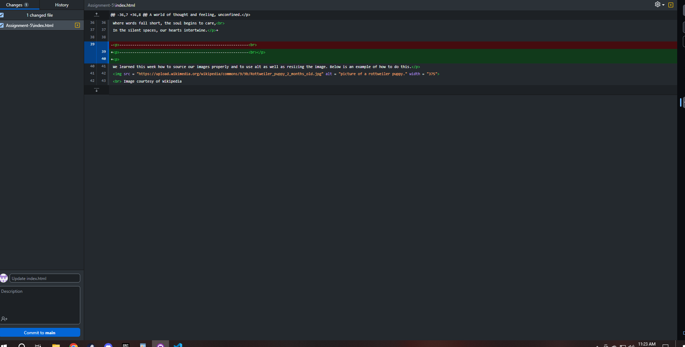
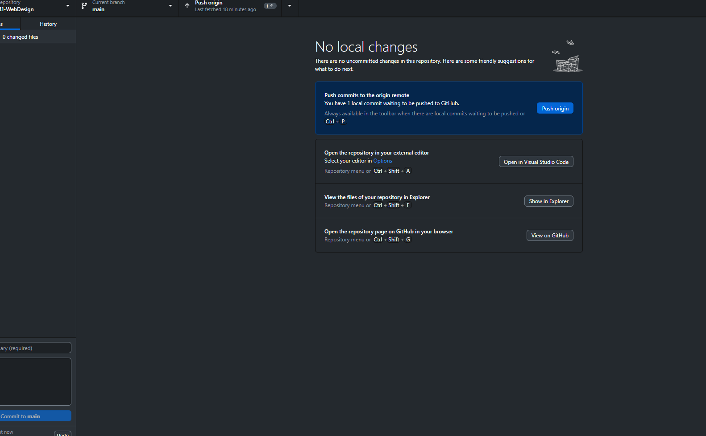

This page shows my Assignment 5, as well as a few examples of the formatting styles I've learned (could be wrong on its not formatting). I did something we didn't
really cover this week as well by reading up on it and that was to change the font itself for the poem. p style= "font-family: fantasy;" style = "font-size: medium;" with the <>

Link to my page:

<a target = "_blank" href = "https://nate-heim.github.io/MART341-WebDesign/Assignment-5/"> Repo </a>

Here is a picture of my text editor in action

And here is one of when it is done:

